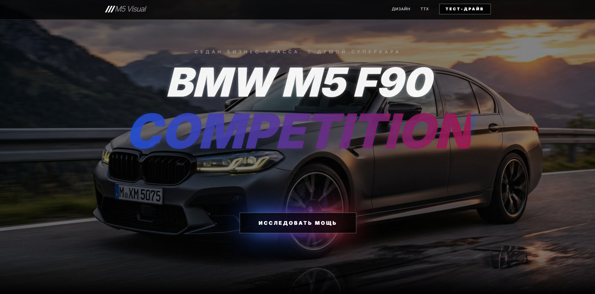

# BMW M5 F90 Competition | Landing Page

<p align="center">

</p>

## 🏎 О проекте
Стильный и современный лендинг, посвященный эталону немецкого автопрома — **BMW M5 F90 Competition**. Проект выполнен с акцентом на визуальную эстетику («wow-effect»), плавность работы и строгий темный дизайн.

> **Status:** Completed / Under Optimization 🚀

---

## Технологический стек
Для реализации проекта были выбраны инструменты, обеспечивающие максимальную производительность и гибкость:

* **HTML5** (Семантическая верстка)
* **CSS3** (Custom Properties, Flexbox, Grid)
* **JavaScript (ES6+)** (Интерактив и анимация)
* **Google Fonts** (Шрифт: Syne / Montserrat)

---

## Ключевые особенности
* **Dark UI:** Агрессивная цветовая палитра, подчеркивающая премиальный статус авто.
* **Responsive Design:** Идеальное отображение на смартфонах, планшетах и 4K мониторах.
* **Smooth Animations:** Плавные переходы при скролле и взаимодействии с кнопками.
* **Interactive Gallery:** Демонстрация деталей кузова и интерьера.

---

## Быстрый старт

1. **Клонирование репозитория**
   ```bash
   git clone [https://github.com/Nw1IE/Bmw_M5_F90_Competition.git](https://github.com/Nw1IE/Bmw_M5_F90_Competition.git)
